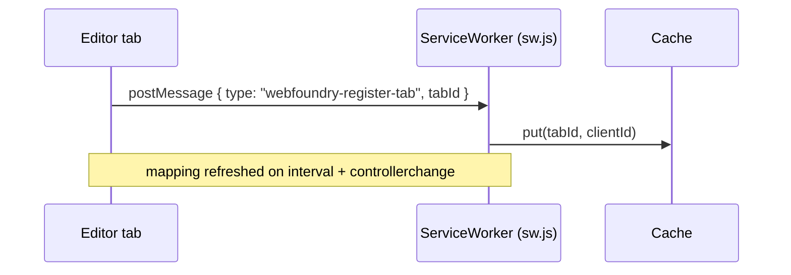
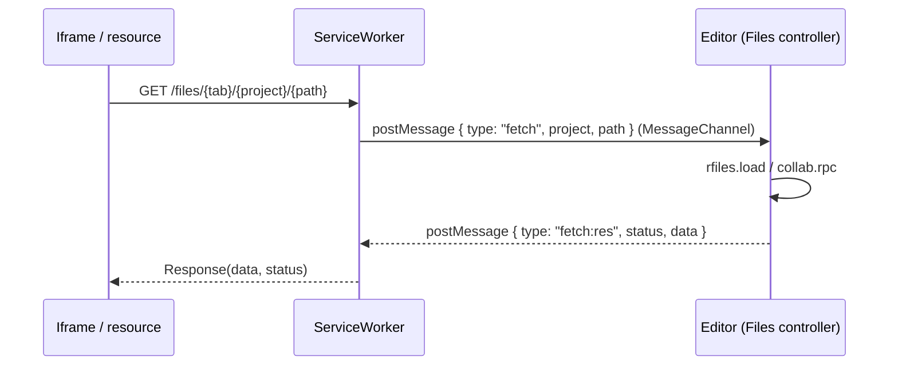
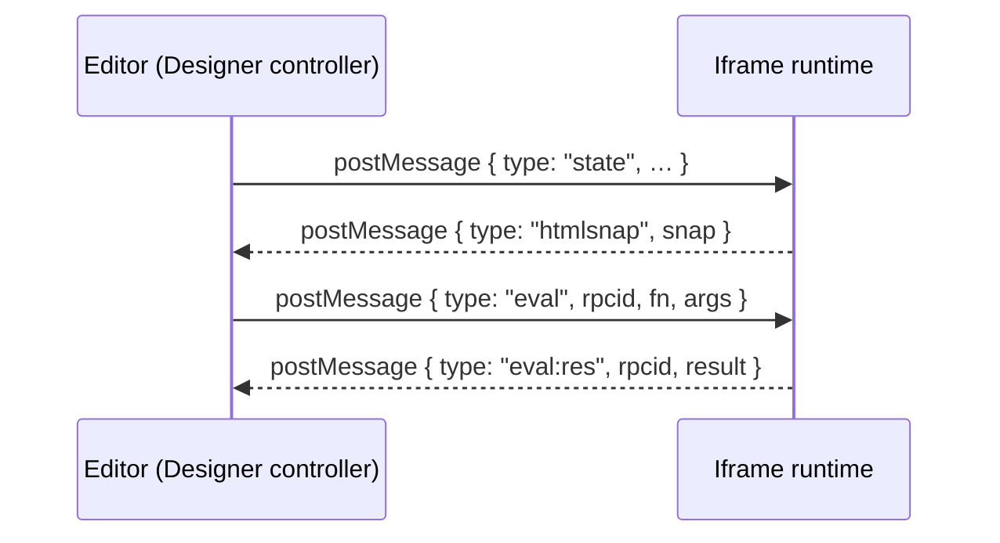

# Webfoundry Pinball Messaging

Webfoundry's runtime moves data between the editor shell, the service worker, and the live design iframe by "pinballing" messages across multiple targets. This note unpacks that flow for three core scenarios: tab registration, file serving via the service worker, and command dispatch into the iframe runtime. Each section references the concrete implementation and includes diagrams to keep the moving parts straight.

## Cast of actors

- **Main UI (editor shell)** – runs `controllers/App.js` and `controllers/Files.js`, keeps project state, and talks to storage.
- **Service worker** – `sw.js` brokers network interception and relays file requests to the owning tab.
- **Design iframe** – the live preview driven by `webfoundry/ifdesigner.js`.
- **Project storage** – handled by `repos/rfiles.js` and, when collaborating, `collab.rpc` calls.

## 1. Tab registration handshake

Every editor tab gets a stable ID so the worker can route fetches back to the right client:

1. `controllers/App.js:17` assigns `sessionStorage.webfoundryTabId` and registers `sw.js` on first load. It keeps the worker mapping fresh by reposting the tab ID every second plus on `controllerchange` (`controllers/App.js:21`).
2. `sw.js:7` stores the `(tabId → clientId)` mapping in a cache entry whenever it receives the `webfoundry-register-tab` message.

This arrangement means the worker never guesses which window owns `/files/{tabId}/…`: it always looks it up.

## 2. Service worker interception and pinball fetch

When an iframe (or any project asset) hits `/files/{tab}/{project}/{path}` or `/preview/{tab}/{project}/{path}`, the worker mediates the request.

1. `sw.js:18-48` screens fetch events. Anything under `/files/` or `/preview/` triggers a custom response.
2. The worker extracts `tabId`, `project`, and the requested `path`. For preview HTML (`/preview/…/*.html`) it rewrites the path to `index.html` so the compiled preview shell loads.
3. The worker opens a `MessageChannel`, posts `{ type: 'fetch', project, path }` to the owning tab (via `clients.get(await getTab(tabId))`), and waits for a reply. A 30 s timeout guards against drops (`sw.js:29`).
4. `controllers/Files.js:33-64` handles that message on the main UI side. It chooses the right storage backend:
   - On the master client, `rfiles.load(project, path)` streams the stored `Blob`.
   - Viewers pull through the collaboration RPC (`collab.rpc('fetch')`) and inflate the gzip payload (`controllers/Files.js:36`).
5. The reply is posted back as `{ type: 'fetch:res', status, data|error }`. If no data is found a 404 blob is returned; exceptions bubble out as 500s.
6. The service worker converts the payload back into a `Response` object. Errors become `Response(error, { status })`; success wraps the `Blob`.

The same flow powers `/preview/…` assets; only the `path` rewrite differs. If the worker cannot find a controlling client (for example, the editor tab closed), it falls back to the network (`sw.js:40`) so published assets keep working.

## 3. Window ↔ iframe command pinball

Once a designer frame is alive, the editor streams state and receives events via `postMessage`.

1. `controllers/Designer.js:233` sends `{ type: 'state', … }` snapshots whenever collaboration cursors or presence change.
2. The iframe runtime (`webfoundry/ifdesigner.js:8-23`) accepts those `state` packets, merges cursor overlays, and scroll-locks the current selection into view.
3. Edits inside the iframe trigger `post({ type: 'htmlsnap', … })` which lands back in `controllers/Designer.js:125-152`, updating the DOM mirror and queuing saves.
4. Actions that need DOM mutations call `ifeval` (`other/actions.js:2060-2086`). That helper wraps the desired function body, assigns an `rpcid`, and posts `{ type: 'eval', fn, rpcid, args }` straight into the iframe.
5. The iframe executes the function (via `new AsyncFunction`) and responds with `{ type: 'eval:res', rpcid, result|error }`, which resolves or rejects the awaiting promise.

This bidirectional channel is what lets toolbar actions, keyboard shortcuts, and collaboration markers stay in sync without breaking the iframe's own execution sandbox.

## 4. Parallel subresource loading example

Imagine a project page that references 20 images, stylesheets, or script modules. When the iframe navigates, all 20 browser fetches enter the same pinball machine almost simultaneously:

1. **Burst of requests** – the iframe queues 20 GETs to `/files/{tab}/{project}/…`. The worker receives each fetch event independently.
2. **20 message channels** – `sw.js` spins up a `MessageChannel` per request, so responses cannot cross streams even though they share the same tab.
3. **Concurrent lookups** – the main UI's `respond()` helper simply awaits `rfiles.load` for each path. Localforage serves blobs from IndexedDB in parallel; remote collaborators decompress each gzip payload as it arrives.
4. **Out-of-order responses** – as soon as `respond()` calls the provided callback, that channel closes and the worker resolves the matching promise. Faster assets (e.g. CSS) make it back first, but the message framing keeps each response tied to its request.
5. **Timeout protection** – any resource that stalls for 30 s triggers the worker's rejection path, returning a `503` so the iframe surfaces a clear failure instead of hanging forever.

Because the worker never serialises the channels, the browser happily pipelines all 20 requests. The main UI remains responsive: every callback just posts a single `fetch:res` message and yields back to the event loop.

## 5. Implementation notes and gotchas

- The worker stores tab mappings in a cache bucket (`caches.open('webfoundry-tabs')`). A stale mapping (for example, after a hard refresh) just means the first intercepted fetch falls back to the network until the tab re-registers.
- `controllers/Files.js:46-64` guards cross-origin iframe requests by verifying the origin belongs to the active project subdomain before echoing responses back.
- Preview mode rewrites HTML paths to `index.html` so the compiled preview shell runs instead of raw page markup.
- Collaboration viewers rely on `collab.rpc('fetch')`, so if the host goes offline their iframe can still load assets as long as the companion stays reachable.
- `other/actions.js:2068-2086` strips the wrapper around the provided function and uses `new AsyncFunction` to keep execution asynchronous; any thrown error is forwarded back to the editor UI for toast notifications.

## Diagram index

- [Tab registration](#1-tab-registration-handshake)
- [Service worker fetch loop](#2-service-worker-interception-and-pinball-fetch)
- [Iframe command channel](#3-window--iframe-command-pinball)

These diagrams render in any Markdown viewer with Mermaid support. If your viewer lacks Mermaid, you can paste the blocks into https://mermaid.live to visualise them.
